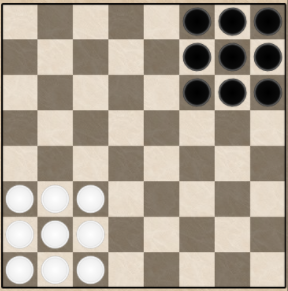

# Technical assignment done for company XYZ (not real name)

## Evaluation criteria

Assessment will focus on knowledge and use of OOP techniques, the system’s scalability and flexibility, and the project’s architectural organization. Readability of the code is important.

## Pluses (optional / recommended):

- Use of design patterns
- IoC / Dependency Injection (for example, Zenject)
- Action delegates
- LINQ
- JSON (for example, to store the initial piece layout)

## Task

Implement the two-player board game “Ugolki” (hot-seat play on one computer).

## Game rules

After the pieces are placed on the chessboard, players alternate turns. On a turn, a player may move a single piece. The winner is the player who moves all of their own pieces into the opponent’s starting positions.

### Starting layout:

## Movement rules (choose in the UI before starting a game)

One of the following movement rule sets must be selectable before play begins:

1. A piece may jump over another piece diagonally (like in checkers).
2. A piece may jump over another piece vertically and horizontally.

## UI requirements

- Option to pick the movement rule before the game starts.
- HUD should show the current move number for each player.

## Ability to restart the game.

End-of-game screen indicating the winner.

## Resources

Piece prefabs must be loaded from the project’s Resources folder.

## Controls

- Click on one of your pieces to select it.
- Click on an empty square to move the selected piece, if the move is legal.

---

